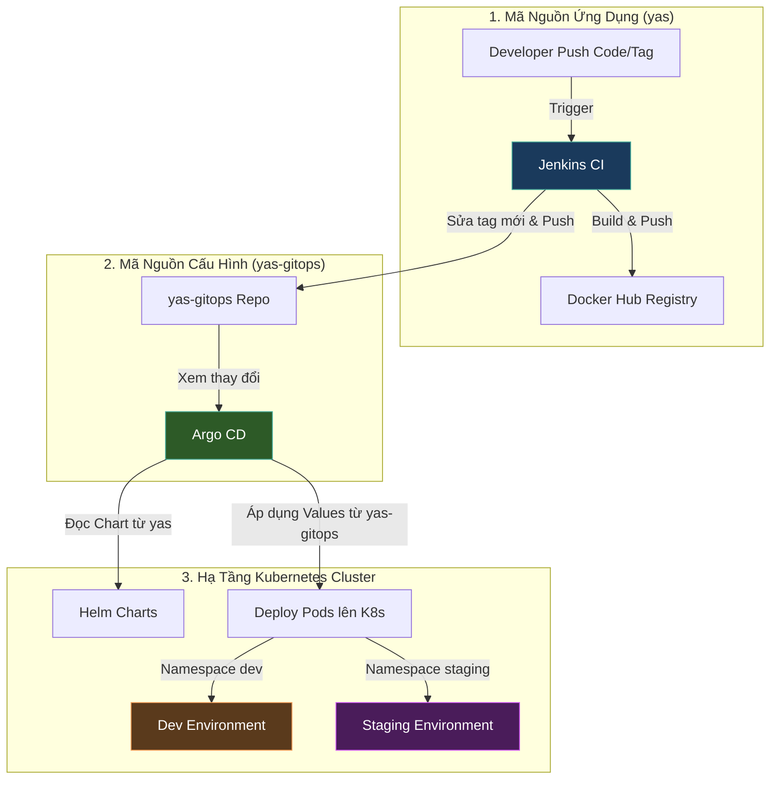

# Hướng Dẫn Triển Khai Luồng GitOps (ArgoCD) Cho Dự Án YAS

Tài liệu này hướng dẫn chi tiết cách thiết lập hệ thống GitOps chuẩn sử dụng **ArgoCD** đáp ứng các yêu cầu (Requirements) của đồ án, đồng thời chỉ ra các lỗi cần sửa trong cấu hình hiện tại của bạn.

---

## 1. Sơ Đồ Luồng GitOps Chuẩn (ArgoCD)

Dưới đây là cách luồng CD vận hành khi sử dụng phương pháp GitOps nâng cao:



---

## 2. Cấu Trúc File Cần Có Trên Các Repository

Để triển khai đúng chuẩn GitOps, bạn cần tổ chức cấu trúc của 2 repositories độc lập như sau:

### A. Repo chính (`yas`): Chứa code và Helm Charts gốc
Thư mục `k8s/charts/` chứa các templates và file `values.yaml` mặc định (để chạy local hoặc làm khuôn mẫu).
```text
yas/
├── storefront/
├── backoffice/
├── ... (các microservices)
└── k8s/
    └── charts/
        ├── product/ (Chứa templates, values.yaml gốc)
        ├── cart/
        └── ...
```

### B. Repo GitOps (`yas-gitops`): Chỉ chứa file thông số đè cho từng môi trường
Repo này **KHÔNG** chứa thư mục `k8s/charts/`. Nó chỉ chứa thông số ghi đè cho từng môi trường:
```text
yas-gitops/
├── dev/
│   ├── product-values.yaml
│   ├── cart-values.yaml
│   └── ...
└── staging/
    ├── product-values.yaml
    ├── cart-values.yaml
    └── ...
```

> [!NOTE]
> **Ví dụ nội dung file `yas-gitops/dev/product-values.yaml`:**
> ```yaml
> backend:
>   image:
>     repository: thaithienphu/product
>     tag: latest  # Jenkins sẽ tự động sửa dòng này thành Commit SHA
>   ingress:
>     enabled: true
>     host: api.yas.local.com
> ```

---

## 3. Cách Cấu Hình ArgoCD Cho Từng Môi Trường

ArgoCD cần biết nơi lấy **Chart gốc** (từ repo `yas`) và nơi lấy **Values đè** (từ repo `yas-gitops`). Dưới đây là khai báo ứng dụng (Application CRD) trên Kubernetes:

### A. Cấu hình môi trường DEV (`dev-app.yaml`)
```yaml
apiVersion: argoproj.io/v1alpha1
kind: Application
metadata:
  name: yas-product-dev
  namespace: argocd
spec:
  project: default
  sources:
    - repoURL: 'https://github.com/tthphat/yas.git' # Repo chứa Helm Chart gốc
      targetRevision: main
      path: k8s/charts/product
    - repoURL: 'https://github.com/tthphat/yas-gitops.git' # Repo chứa Values đè
      targetRevision: main
      ref: gitops
  destination:
    server: 'https://kubernetes.default.svc'
    namespace: dev # Deploy vào namespace dev
  syncPolicy:
    automated:
      prune: true
      selfHeal: true
    syncOptions:
      - CreateNamespace=true
  # Kết hợp Chart gốc với file values đè từ repo GitOps
  helm:
    valueFiles:
      - $gitops/dev/product-values.yaml
```

### B. Cấu hình môi trường STAGING (`staging-app.yaml`)
Tương tự như môi trường Dev, chỉ khác ở phần `namespace` và file `values.yaml` được sử dụng:
```yaml
      # ... phần cấu hình trên giữ nguyên ...
  destination:
    server: 'https://kubernetes.default.svc'
    namespace: staging # Deploy vào namespace staging
  helm:
    valueFiles:
      - $gitops/staging/product-values.yaml
```

---

## 4. Những Điều Cần Sửa Hiện Tại

Để đáp ứng đúng các yêu cầu trên, bạn cần sửa lại cấu trúc repo GitOps và file `Jenkinsfile` hiện tại:

### Bước 1: Sửa đổi trên Repo GitOps (`yas-gitops`)
1. **Xóa** thư mục `k8s/charts/` đang bị copy trùng lặp trên repo này.
2. **Tạo** 2 thư mục: `dev/` và `staging/`.
3. Trong mỗi thư mục, tạo các file cấu hình đè `<service>-values.yaml` tương ứng cho từng microservice.

### Bước 2: Sửa đổi trong `Jenkinsfile` ở dự án chính
Thay đổi logic sửa tag ở stage **`Update GitOps Repo`** để nó trỏ đúng vào thư mục môi trường thay vì thư mục chart gốc:

```diff
 stage('Update GitOps Repo') {
     when {
         branch 'main'
     }
     steps {
         script {
             def services = env.SERVICES_TO_BUILD.split(',')
 
-            def serviceToChart = [
-                'backoffice': 'backoffice-ui',
-                'storefront': 'storefront-ui',
-            ]
-
             sh """
                 rm -rf yas-gitops
                 git clone https://github.com/tthphat/yas-gitops.git
                 cd yas-gitops
             """
 
             services.each { service ->
-                def chartName = serviceToChart.get(service, service)
-                def valuesPath = "k8s/charts/${chartName}/values.yaml"
-                echo "=== Updating ${valuesPath} → tag: ${env.COMMIT_SHA} ==="
-                sh "sed -i 's/^    tag:.*/    tag: ${env.COMMIT_SHA}/' yas-gitops/${valuesPath}"
+                // Cập nhật tag mới vào file values của môi trường dev
+                def valuesPath = "dev/${service}-values.yaml"
+                echo "=== Updating GitOps ${valuesPath} → tag: ${env.COMMIT_SHA} ==="
+                sh "sed -i 's/^    tag:.*/    tag: ${env.COMMIT_SHA}/' yas-gitops/${valuesPath}"
             }
 
             sh """
                 cd yas-gitops
                 git add .
                 git -c user.name='Jenkins CI' -c user.email='ci@jenkins' commit -m "Update image tags to ${env.COMMIT_SHA}"
                 git push origin main
                 cd .. && rm -rf yas-gitops
             """
         }
     }
 }
```

### Bước 3: Tạo luồng riêng cho Staging khi có Git Tag
Để đáp ứng yêu cầu deploy lên `staging` khi có Git Tag (ví dụ `v1.2.3`), bạn cần cấu hình Jenkinsfile lắng nghe các sự kiện Tag và cập nhật tag đó vào thư mục `staging/` trên GitOps Repo thay vì `dev/`.
